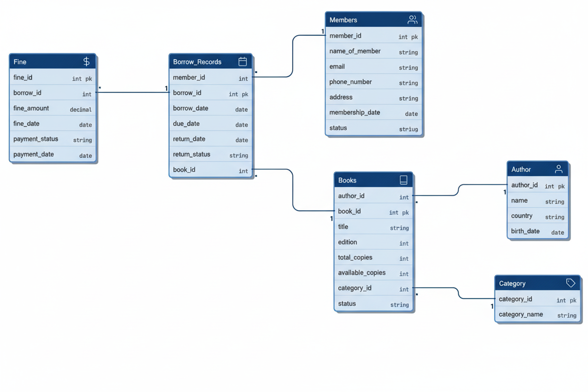

# Library Management System

## Project Overview

This project demonstrates how the core backend operations of a real library are handled using SQL. It covers everything from simple CRUD tasks to more advanced logic using triggers and stored procedures. The queries included here move step-by-step from basic operations to more involved workflows—such as checking book availability, updating inventory automatically when a book is returned, and maintaining consistent stock records across multiple tables.

You will also find queries that go beyond routine operations. For example, identifying the member who has borrowed the most books, finding which titles are the most popular, and tracking unpaid fines. The goal is not just to show the daily functions of a library, but to present a complete system that uses SQL to its full potential.

The dataset records detailed information about each book, along with member details and their borrowing histories. It also keeps track of active and inactive members based on their borrowing activity. Overall, this project provides a practical view of how library management systems work behind the scenes and serves as a learning reference for understanding relational database design and operations.

## Key Features

* **Book inventory management** – Complete catalog with availability tracking
* **Member registration and tracking** – Member profiles with status monitoring
* **Book borrowing and return system** – Automated workflow with due dates
* **Overdue fine calculation** – Automatic fine computation with triggers
* **Report generation** – Statistical insights and analytics

## Objectives

* Design a robust database schema with proper relationships
* Implement comprehensive CRUD operations
* Demonstrate advanced SQL queries (joins, subqueries, aggregations)
* Utilize triggers for automated processes
* Create stored procedures for complex operations
* Optimize performance with indexes
* Generate views for common reporting needs

## Database Schema

### Entity-Relationship Diagram



### Table Overview

This system consists of 6 core tables:

* **Author** – Author information and demographics
* **Category** – Book classification system
* **Books** – Complete book catalog with inventory
* **Members** – Registered member profiles
* **Borrow_Records** – Transaction history
* **Fine** – Overdue fine management

For detailed table descriptions, see [Tables Documentation](docs/tables_description.md).

## Quick Start

### Prerequisites

Before setting up the project, ensure you have one of the following database systems installed:

* MySQL 8.0 or higher
* PostgreSQL 13 or higher
* SQL Server 2019 or higher

### 1. Clone the repository

```
git clone https://github.com/Aricnos/Library-Management-System.git
cd Library-Management-System
```

### 2. Create Database

```bash
mysql -u root -p
```

Then run:

```bash
CREATE DATABASE library_db;
USE library_db;
```

### 3. Execute all files in order

```bash
mysql -u root -p library_db < database/1_libmain_schema.sql
mysql -u root -p library_db < database/2_insert_sample_data.sql
mysql -u root -p library_db < database/3_core_crud_operations.sql
mysql -u root -p library_db < database/4_inventory_management_features.sql
mysql -u root -p library_db < database/5_borrow_management_features.sql
mysql -u root -p library_db < database/6_advanced_operations.sql
mysql -u root -p library_db < database/7_indexes_and_optimization.sql
mysql -u root -p library_db < database/8_views_and_reports.sql
```

### 4. Verify the installation

```bash
USE library_db;
SHOW TABLES;
SELECT COUNT(*) FROM Books;
```

## Project Structure

```
Library-Management-System/
│
├── README.md
├── LICENSE
│
├── database/
│   ├── 1_libmain_schema.sql
│   ├── 2_insert_sample_data.sql
│   ├── 3_core_crud_operations.sql
│   ├── 4_inventory_management_features.sql
│   ├── 5_borrow_management_features.sql
│   ├── 6_advanced_operations.sql
│   ├── 7_indexes_and_optimization.sql
│   └── 8_views_and_reports.sql
│
├── docs/
│   ├── database_schema_diagram.png
│   ├── tables_description.md
│   ├── trigger_flow_diagram.png
│   └── stored_procedure_logic.md
│
├── outputs/
│   ├── sample_queries_results.txt
│   └── screenshots/
│       ├── schema_workbench.png
│       ├── books_inventory.png
│       ├── borrow_records.png
│       ├── overdue_report.png
│       └── fine_calculation.png
│
└── utils/
    └── reset_database.sql
```

## Core Functionality

### Automated book borrowing

```bash
CALL borrow_book(3, 2); -- Member ID 2 borrows Book ID 2
```

### Automated book returning

```bash
CALL return_book(3, 2, 1); -- Returns book and calculates fine if overdue
```

### Popular books report

```bash
SELECT * FROM v_book_availability WHERE borrowed_copies > 5;
```

## Sample Queries

### Find available books by category

```bash
SELECT b.title, a.name AS author, b.available_copies
FROM Books b
JOIN Author a ON b.author_id = a.author_id
JOIN Category c ON b.category_id = c.category_id
WHERE c.category_name = 'Fiction' AND b.available_copies > 0;
```

### Identify overdue books

```bash
SELECT m.name_of_member, b.title, br.due_date,
DATEDIFF(CURRENT_DATE(), br.due_date) AS days_overdue
FROM Borrow_Records br
JOIN Members m ON br.member_id = m.member_id
JOIN Books b ON br.book_id = b.book_id
WHERE br.return_status = 'Pending'
AND CURRENT_DATE() > br.due_date;
```

For more examples, see [Query Examples](docs/query_examples.md).

## Advanced Features

### Triggers

* **Auto Fine Calculation** – Automatically calculates fines when books are returned late

### Stored Procedures

* **Borrow Book** – Handles complete borrowing workflow
* **Return Book** – Manages the return process with status updates
* **Inventory Update** – Updates available copies on borrow/return transactions

### Views

* **v_book_availability** – Real-time book availability status
* **v_unpaid_fines** – Outstanding fine tracking
* **v_currently_borrowed** – Active borrowing records

## Sample Data

The system comes pre-loaded with:

* **31 Authors** – From various countries
* **10 Categories** – Covering major genres
* **33 Books** – With realistic inventory
* **5 Members** – With varied activity
* **6 Borrow Records** – Including overdue entries
* **2 Fine Records** – Demonstrating payment tracking

## Learning Outcomes

This project demonstrates:

* Database normalization and schema design
* Foreign key relationships and referential integrity
* Complex JOIN operations
* Aggregate functions and GROUP BY
* Subqueries and correlated queries
* Transaction handling
* Trigger implementation
* Stored procedure development
* Index optimization strategies
* View creation for reporting

## License

This project is licensed under the MIT License – see the [LICENSE](LICENSE) file for details.

## Author

**Palash Chaudhary**

* GitHub: [@Aricnos](https://github.com/Aricnos)

---

Version 1.0.0